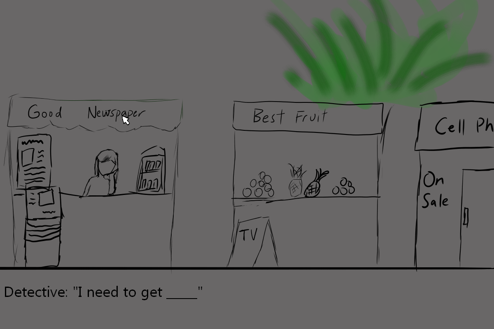

# Detective Game

Author: Shao-Ju Wang

Design: This is unfinished (I spent too much time on the story), my plan was to create a game that a Detective needs to find choices from the environment  

Text Drawing: I tried to use harfbuzz and freetype to render text, but it didn't work, so I had to use the DrawLine function

Choices: (TODO: how does the game store choices and narrative? How are they authored? Anything nifty you want to point out?)

Screen Shot:

How To Play:

SPACE to go to next line, while "A" and "D" scroll horizontally, mouse to click choices.

Sources: GentiumBookPlus-Regular.ttf

This game was built with [NEST](NEST.md).

